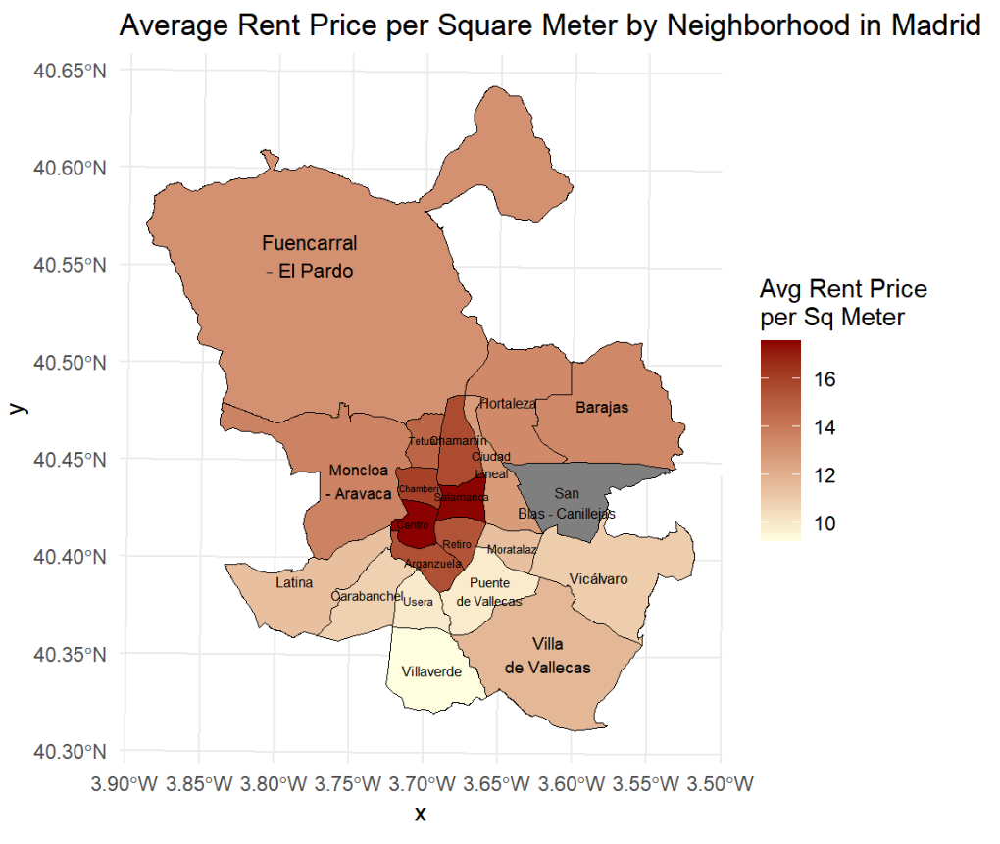

# 🏠 Housing Market Analysis in Madrid

This project is a **data-driven analysis of the Madrid housing market**, developed as part of the *Data Science for Business Analytics* course.  
The goal was to uncover actionable insights for real estate pricing strategies and investment decisions by combining **exploratory data analysis (EDA)**, **predictive modeling**, and **interpretative reporting**.

---

## 📌 Overview
- **Objective**: Identify key factors influencing buying and rental prices in Madrid.
- **Dataset**: Property listings from Kaggle + geographic shapefiles of Madrid districts.
- **Approach**:
  1. Exploratory Data Analysis (EDA) → visualize trends in buying and rental prices.
  2. Feature Engineering → create meaningful variables from property characteristics.
  3. Predictive Modeling → regression models and decision trees to predict prices.
  4. Interpretability → extract business insights for pricing and investment strategies.

---

## 🛠️ Tech Stack
- **R**: tidyverse, readxl, ggplot2, rpart, rpart.plot, sf, caret  
- **Quarto**: project reports in `.qmd` (rendered to `.html`)  
- **Excel**: processed dataset  

---

## 📊 Key Insights
- **Property size** strongly influences both buying and rental prices.  
- **Rental prices** show a visible ceiling around **€2,500**.  
- **Outliers** are common in luxury areas (size/price extremes).  
- **Rooms and bathrooms** are strong predictors.  
- **Neighborhood impact** is significant: central/northern districts are most expensive.  
- **Amenities** like parking and lifts add strong value in urban areas.  

---

## 🚀 Project Structure
```bash
housing-market-madrid/
├── data/ # Raw + processed datasets
├── notebooks/ # Quarto documents (.qmd) and rendered report
│ └── sections/ # Introduction, EDA, analysis, conclusion
├── src/ # R scripts
├── assets/ # Graphs, screenshots
└── README.md
```

---

## 📂 Data
- **Raw**: Kaggle property listings + Madrid district shapefiles (`data/raw/Distritos/`).  
- **Processed**: `data/processed/houses_Madrid.xlsx`.  

> Data are from Kaggle and are included for reproducibility.  

---

## 🧰 How to Run
Clone the repository:
```bash
git clone https://github.com/stesima/housing-market-madrid.git
cd housing-market-madrid
```

Open the project in RStudio or VS Code and render the Quarto file:
```bash
# In RStudio: "Render" from the IDE
# Or from the terminal, with Quarto installed:
quarto render notebooks/final_Z.qmd
```
Required R packages:
```r
install.packages(c("tidyverse","readxl","ggplot2","rpart","rpart.plot","sf","caret"))
```
---

## 📫 Contact
Author: **Stefano Sima**  
[LinkedIn](https://www.linkedin.com/in/stesima) · stefano.sima@outlook.it

---

## 📈 Sample Visualization



